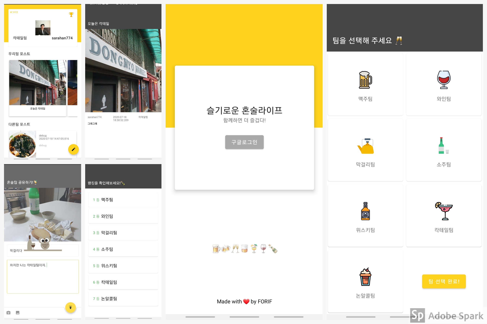
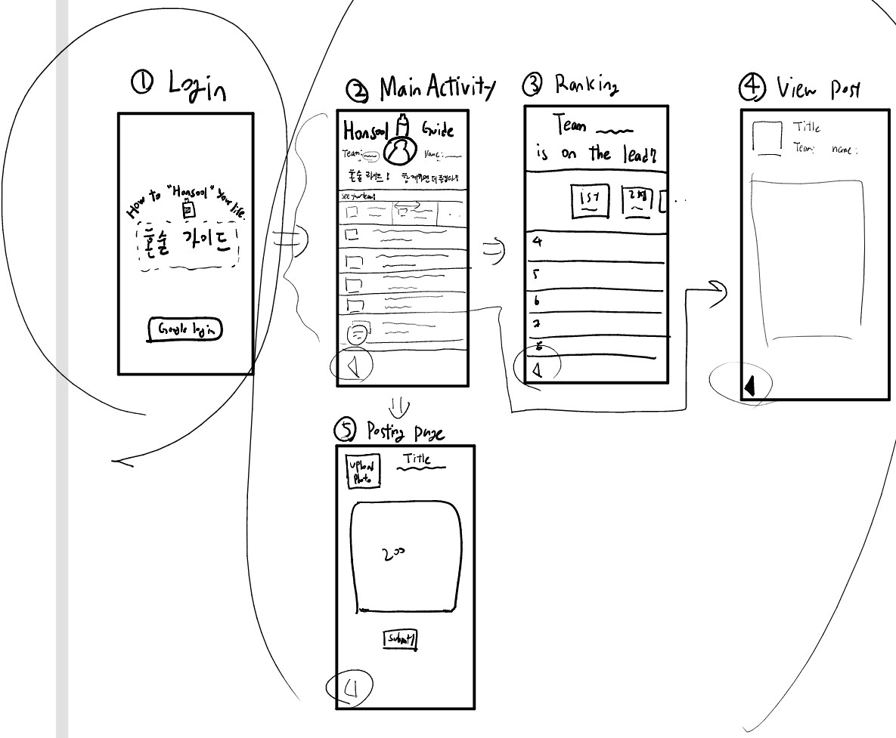

# FORIF-2020-1-Hackathon
* Android 팀 해커톤 작품 - 혼술라이프 (Hon-Sool Life)
* 개발자 : 임규민, 한가희, 김은호, 이강민, 환규님 


### App Logo 

* Designed by 김은호 


## 스크린샷 및 시연 영상 




#### 영상 

* [Youtube 링크](https://youtu.be/WgFu_LUoCO8)


## 혼술라이프! 함께하면 더 즐겁다!

### 서비스 요약 
**1. 사용자는 로그인 후에 자신의 혼술팀을 선택할 수 있다.(LoginActivity)**

  * 팀 종류 : 소주팀, 맥주팀, 칵테일팀, 위스키팀, 와인팀, 논알콜팀, 막걸리팀, 섞어팀 (총 8개)

**2. 혼술팀을 선택한 후 사용자는 자신의 혼술 기록을 남길 수 있다.(PublishPostActivity)** 
  * 메인 화면의 Floating Action Button 을 누르면 포스트 작성하기 Activity 로 넘어간다.
  * 혼술 기록을 남기면 1.5배의 가중치를 곱해서 팀의 랭킹이 더 많이 올라간다. 
    * 갤러리 형식의 기록 (사진제목 + 사진 + 사진 설명 및 본인의 생각 작성)
    * 내용 글자제한 : 200자 
    * 사진은 1장만 
    

**3. 사용자는 메인 화면(MainActivity)에서 다른팀이 작성한 포스트를 볼 수 있다.**
  * RecyclerView 에 카드 (ViewHolder : 사진과 작성자 이름, 사진 제목, 팀이름)
  * 카드 클릭하면 사용자가 작성한 내용이 나온다. (상단에 이미지, 제목, 닉네임 - 하단에 내용)
    * **PostDetailActivity** 로 화면을 전환하여 보여준다. 
  * 메인 화면의 가장 위에는 자신의 프로필, 닉네임, 팀이름이 디스플레이된다. (프로필 카드 형식으로. MaterialCardView 사용하면 될듯)
    * 로그아웃은 프로필 카드의 `로그아웃` 버튼을 클릭하면 된다. 
  * 메인 화면의 상단에는 자신의 팀이 작성한 포스트가 디스플레이된다. (Horizontal RecyclerView)
  * 하단에는 다른 팀들이 작성한 포스트들이 작성된 시간 순서대로 디스플레이된다. (Vertical RecyclerView)

**4. 사용자는 랭킹 화면(RankingActivity)에서 팀별 랭킹을 조회할 수 있다.**
  * 1등, 2등, 3등은 ViewPager 를 이용해서 보여주고, 나머지 팀들은 아래에 작은 리스트로 보여준다(?).
팀을 선택하면 팀 랭킹이 올라간다. 

### UI Flow 



### Data Modeling 
* 유저가 포스트를 작성하면 아래와 같이 데이터가 저장된다. 
```
"Uploads" : {
  "{post_unique_token}" : {
      "userName" : "아무개", 
      "createdAt" : "2020-10-10", 
      "photoUrl" : "someserver.com/myimage.jpg", 
      "postContent" : "200 letters of your thoughts ... ", 
      "teamName" : "TeamSoju"
    }
}
```


* 다음과 같이 랭킹을 유지한다. 랭킹은 NumPost 에 1.5배의 가중치 + Participants 로 결정된다. 
```
“Ranking” : {
	“Soju” : {
		“Participants” : 10, 
		“NumPost” : 5
  }
}
```

